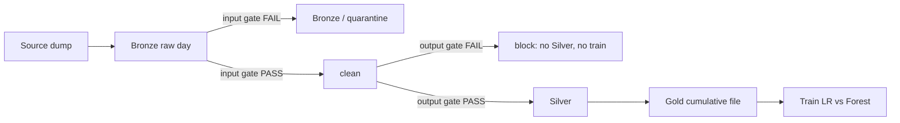

# Telco churn pipeline

A small daily ML data pipeline on a **medallion** (Bronze / Silver / Gold) layout: ingest a CSV, check it, clean it, store it, and train a churn model **only if both quality gates pass**.

Dataset: **IBM Telco Customer Churn** (also on Kaggle) — 7,043 customers, 21 columns. Pulled from the public IBM mirror:

https://raw.githubusercontent.com/IBM/telco-customer-churn-on-icp4d/master/data/Telco-Customer-Churn.csv

This is a churn problem on purpose, not a stand-in for any binary classification task. Churn means a customer leaving an **ongoing, renewable** relationship (a phone/internet contract they can cancel). Telco billing, tenure, and contract type are the real-world analog of that. 

Measured on the source file: **73.5% No / 26.5% Yes** churn. 
`TotalCharges` arrives as **text**, and is blank for exactly **11** customers, all with `tenure = 0` (signed up, never billed yet). That quirk is allowed at the input gate and filled with `0` in `clean()`.

---

## Assumption: there is no date column

The dump has no per-row date. We do **not** pretend rows arrived on a real calendar.

`scripts/generate_daily_batches.py` shuffles the full file with a **fixed seed (42)**, splits it into **10** slices, and writes `data/bronze/YYYY-MM-DD.csv` starting **2026-01-01**. Same seed → same days every rerun.

**2026-01-04** is poisoned on purpose (duplicate `customerID`, null `gender`, `MonthlyCharges = 201`, `Churn = maybe`, 50 rows) so the input gate has a real failure to catch.

---

## Medallion architecture (Bronze / Silver / Gold)

Storage follows the **medallion** pattern: three layers of increasing trust. Bronze is the landing zone (raw, including rejects). Silver is cleaned data that passed both gates. Gold is the cumulative, training-ready corpus written to disk after each good day.

```
data/source/telco_customer_churn.csv   original IBM dump (not a daily drop)
data/bronze/YYYY-MM-DD.csv             Bronze: raw arrival, untouched
data/bronze/quarantine/                still Bronze: rejected raw file
data/silver/YYYY-MM-DD.csv             Silver: one cleaned day, both gates passed
data/gold/YYYY-MM-DD.csv               Gold: all Silver days up to today (what we train on)
reports/YYYY-MM-DD.json                which gate fired, whether training ran
models/YYYY-MM-DD_metrics.json         both models' test scores
```

Quarantine lives **inside Bronze**: a rejected day is still a raw landing-zone file, just flagged. It is not Silver.

Gold is a **file on disk**, not a dataframe that disappears when Python exits. Open `data/gold/2026-01-10.csv` and you are looking at exactly what the last model trained on.



These folders are **in the repo** so you can inspect a finished run without executing anything. Start here:

- Bad day, raw: `data/bronze/quarantine/2026-01-04.csv` (and the same file still under `data/bronze/`)
- Why it failed: `reports/2026-01-04.json`
- No Silver/Gold/model for 2026-01-04 — that is the point
- Final corpus: `data/gold/2026-01-10.csv` (6,339 rows; the bad slice never entered)
- Scores: `models/2026-01-10_metrics.json`

`.joblib` model binaries are gitignored (not readable in GitHub). Metrics JSON is kept.

To **rebuild** the same artifacts from scratch:

```bash
python3 -m venv .venv
source .venv/bin/activate
pip install -r requirements.txt
bash scripts/run_demo.sh
```

That script (1) regenerates the 10 Bronze days, then (2) runs `python -m src.pipeline --all`. 
One day only: `python -m src.pipeline --date 2026-01-04`.
Tests: `pytest tests/ -v`.

---

## Quality gates

**Input gate** (`validate()`): is the *source file* OK?  
**Output gate** (`validate_cleaned()`): did *our* `clean()` do what it claimed?

Same action if either fails (no Silver, no training). 
Different owner: input fail → bad dump; 
output fail → bug in this repo. 
Reports are tagged `"gate": "input"` or `"gate": "output"`.
Hard = block the day. Soft = log only, still proceed.

### Input gate

| Check | Hard / soft | Why |
|---|---|---|
| All 21 required columns present | Hard | A missing `Churn` or `customerID` column is a broken extract, not a quiet day. |
| No nulls in `customerID`, `gender`, `tenure`, `MonthlyCharges`, `TotalCharges`, `Contract`, `Churn` | Hard | You cannot bill or label a row you cannot identify. **Blank `TotalCharges` is allowed**, that is the 11 never-billed customers, not missing data. Garbage text is not. |
| No duplicate `customerID` | Hard | Two rows, one person → the model would double-count them. |
| `TotalCharges` parseable as a number once blanks are stripped | Hard | `" "` is a new customer. `"N/A"` is a broken export. |
| `tenure` in 0–72 | Hard | 0 = just signed up. 72 = this product’s 6-year window. 999 is not a customer lifetime. |
| `MonthlyCharges` in $0–$200 | Hard | Dataset max is $118.75; $119 still passes. $201 / $9999 does not. |
| `gender`, `Contract`, `InternetService`, `PaymentMethod`, `Churn` in closed lists | Hard | `Churn = maybe` is not a label we can train on. |
| Row count ≥ 100 | Hard | A good day is ~704 rows. 50 rows is a truncated file, not a slow Tuesday. |
| Today’s rows vs last 3 days’ average, outside 0.5–1.5× | **Soft** | Asks “did the *file size* jump?” A holiday dump can be small and still valid. Never blocks. |


### Output gate (all hard)

`clean()` strips text, sets blank `TotalCharges` → 0, encodes `Churn` Yes/No → 1/0, drops exact duplicate rows. It runs only after the input gate passed.

| Check | Why |
|---|---|
| Keep ≥ 98% of raw rows | `clean()` should only drop exact duplicates. Losing half the file is a bug in `clean()`, not in the vendor CSV. |
| Zero nulls in `TotalCharges` | After clean, blanks must be 0. A leftover NaN means we failed the tenure=0 case. |
| `Churn` only `{0, 1}`, no nulls | Training needs a binary target. `"Yes"` still sitting there means encoding was skipped. |
| `tenure`, `MonthlyCharges`, `TotalCharges`, `SeniorCitizen` numeric dtypes | The model’s numeric branch cannot one-hot a string tenure. |
| No duplicate `customerID` | Duplicates must not survive into Silver. |

---

## What a real `--all` run did

`bash scripts/run_demo.sh` (seed 42). Numbers below are from that run, not estimates.

| date | input | output | training |
|---|---|---|---|
| 2026-01-01 | PASS | PASS | TRAINED LogisticRegression (roc_auc=0.8492) |
| 2026-01-02 | PASS | PASS | TRAINED LogisticRegression (roc_auc=0.8711) |
| 2026-01-03 | PASS | PASS | TRAINED LogisticRegression (roc_auc=0.8583) |
| **2026-01-04** | **FAIL** | **SKIP** | **SKIPPED (input gate failed, so training will not run)** |
| 2026-01-05 | PASS | PASS | TRAINED LogisticRegression (roc_auc=0.8468) |
| 2026-01-06 | PASS | PASS | TRAINED LogisticRegression (roc_auc=0.8215) |
| 2026-01-07 | PASS | PASS | TRAINED LogisticRegression (roc_auc=0.8387) |
| 2026-01-08 | PASS | PASS | TRAINED LogisticRegression (roc_auc=0.8473) |
| 2026-01-09 | PASS | PASS | TRAINED LogisticRegression (roc_auc=0.8204) |
| 2026-01-10 | PASS | PASS | TRAINED LogisticRegression (roc_auc=0.8348) |

2026-01-04 hard failures (from `reports/2026-01-04.json`): null `gender`, duplicate `customerID`, charge outside $0–$200, `Churn=maybe`, 50 rows. Also a **soft** volume flag (`ratio=0.07`). Soft did not decide the outcome.

### Final-day model (Gold as of 2026-01-10)

6,339 rows, stratified 80/20 → **5,071 train / 1,268 test**. Both candidates share a `ColumnTransformer` (median + scale on numerics, most-frequent + one-hot on categoricals). Winner = higher **ROC-AUC**.

| Model | Accuracy | Precision | Recall | F1 | ROC-AUC |
|---|---:|---:|---:|---:|---:|
| **LogisticRegression (saved)** | 0.803 | 0.648 | 0.575 | 0.609 | **0.835** |
| RandomForestClassifier | 0.797 | 0.645 | 0.531 | 0.583 | 0.832 |

LogisticRegression confusion matrix on the test set (rows = actual No/Yes, columns = predicted No/Yes):

```
[[823, 106],
 [144, 195]]
```

823 true negatives, 106 false alarms, 144 missed churners, 195 caught. RandomForest was trained too; it lost on AUC by a small margin. 

---

## Out of scope

| Not built | Why not, for a 48-hour take-home |
|---|---|
| Statistical drift (PSI, Kolmogorov–Smirnov) | Needs feature histograms over time, extra libraries, and a product call on “how much shift is too much.” The volume ratio only asks if the *file* is a weird size. |
| Airflow / Dagster / Prefect | `--all` is a for-loop on dates. A scheduler would hide the path this assignment is meant to show. |
| MLflow / model registry | Two candidates and a JSON file are enough to prove selection. A registry is for many experiments and rollback. |
| Docker | `pip install -r requirements.txt` is the environment. A container would be packaging, not pipeline design. |
| S3 / GCS / Delta Lake | Local folders make Bronze/Silver/Gold inspectable in the repo. Cloud storage would add IAM, not a new quality idea. |
| PagerDuty / Slack alerts | `reports/*.json` plus stdout is the audit trail. Alerting is “who gets paged,” not “did the gate fire.” |

---

## What I’d add for production

- **Validation:** [Great Expectations](https://greatexpectations.io/) or [Pandera](https://www.union.ai/pandera) so checks are declared data docs, not only Python `if`s.
- **Orchestration:** [Airflow](https://airflow.apache.org/) or [Dagster](https://dagster.io/) to schedule the daily drop, retry, and keep a run history.
- **Experiments + registry:** [MLflow](https://mlflow.org/) to log both candidates, register the winner, and roll back.
- **Drift:** [Evidently](https://www.evidentlyai.com/) or [NannyML](https://www.nannyml.com/) to watch tenure/churn distributions after the model is live — the thing the volume check is not.
- **Serving / warehouse:** write Gold to Postgres or a warehouse table; serve the `.joblib` behind a small FastAPI if predictions need an API.

Thresholds live in `config.yaml`. 
